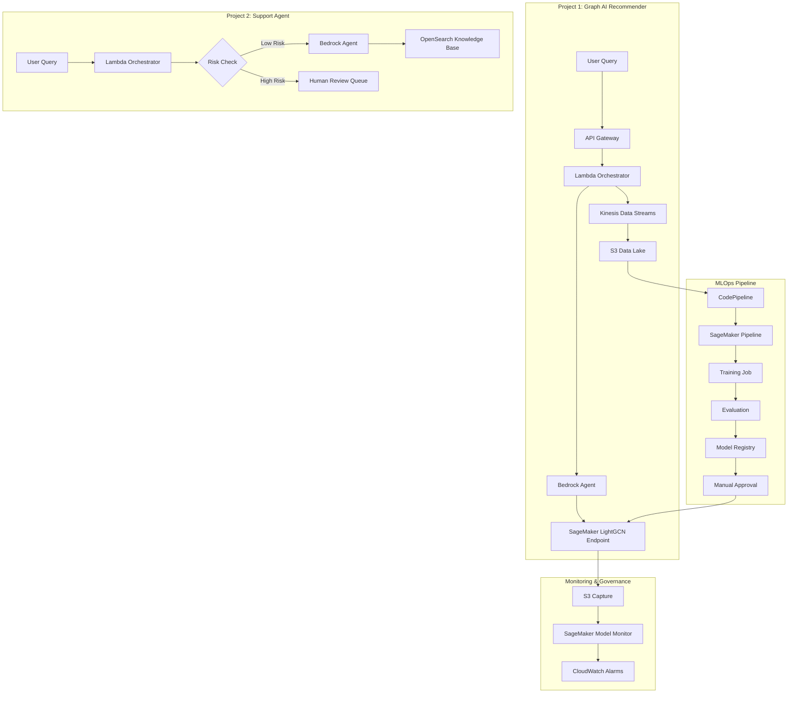

# AWS Graph AI Platform for LEGO Recommendation and Customer Support

A demo platform combining generative AI and graph machine learning for product recommendations and customer support, built on AWS. It uses fictional LEGO product data.

---

## Overview

This system combines LLM-based agents with graph-based ML to support product discovery and customer support workflows.

* **Graph-based recommendations** — A Bedrock agent interprets user queries and retrieves relevant product nodes from a LEGO knowledge graph. A SageMaker LightGCN model ranks candidates based on user–item interactions.
* **Agent-based support workflows** — Bedrock agents handle customer support conversations with structured workflows, validation checks, and escalation paths.
* **Monitoring and governance** — Drift and bias monitoring for embeddings and models, along with tracing and latency tracking for LLM calls.
* **MLOps pipelines** — SageMaker Pipelines and CodePipeline handle training, evaluation, and deployment with approval gates and controlled rollouts.

---

## System Architecture

The platform is split into four main components:

1. **Graph AI Product Recommender (Project 1)**
   Handles product recommendations using a combination of Bedrock and a SageMaker LightGCN model.

2. **Customer Support Agent (Project 2)**
   Provides conversational support using Bedrock Agents with guardrails and escalation to humans when needed.

3. **ML Monitoring & Governance (Project 3)**
   Tracks model performance, embedding drift, and prompt regressions across both systems.

4. **MLOps Pipeline (Project 4)**
   Automates training and deployment of the recommendation model with validation and approval steps.

---

### Unified Architecture



---

## Projects

| # | Project                      | Folder                           | AWS Services                                 | Summary                                      |
| - | ---------------------------- | -------------------------------- | -------------------------------------------- | -------------------------------------------- |
| 1 | Graph AI Product Recommender | `01-lego-recommendation-engine/` | Bedrock, SageMaker, Kinesis, S3, DynamoDB    | Hybrid LLM + GNN recommendation system       |
| 2 | Customer Support Agent       | `02-customer-support-agent/`     | Bedrock Agents, OpenSearch, Lambda, SQS      | Conversational support with escalation flows |
| 3 | ML Monitoring & Governance   | `03-ml-model-monitoring/`        | SageMaker Model Monitor, Clarify, CloudWatch | Drift, bias, and prompt monitoring           |
| 4 | MLOps Pipeline               | `04-mlops-production-pipeline/`  | CodePipeline, SageMaker Pipelines, CDK       | Training and deployment automation           |

---

## Project 1: Graph AI Product Recommender

A recommendation system combining LLM reasoning with graph machine learning.

📁 `01-lego-recommendation-engine/`

Key components:

* Bedrock agent for interpreting user queries and mapping them to catalog entities
* SageMaker LightGCN endpoint for ranking products using graph embeddings
* Event pipeline using Kinesis → S3 for logging and retraining data
* Guardrails to prevent invalid or hallucinated product outputs
* Audit logging in DynamoDB for traceability

---

## Project 2: Customer Support Agent

A conversational support system built on Bedrock Agents with structured safety and escalation logic.

📁 `02-customer-support-agent/`

Key components:

* Bedrock Agent handling multi-step workflows
* RAG-based retrieval from OpenSearch knowledge base
* Risk classification layer before agent execution
* Confidence scoring with escalation to human review via SQS
* Versioned prompts stored in S3

---

## Project 3: ML Monitoring & Governance

Monitoring and evaluation system for both recommendation and support workflows.

📁 `03-ml-model-monitoring/`

Key components:

* Drift monitoring for graph embeddings using SageMaker Model Monitor
* Bias evaluation using SageMaker Clarify
* Prompt regression testing in CI/CD
* CloudWatch dashboards for system metrics
* Alerting via SNS and Lambda

---

## Project 4: MLOps Pipeline

Automated pipeline for training and deploying the LightGCN model.

📁 `04-mlops-production-pipeline/`

Key components:

* SageMaker Pipelines for preprocessing, training, and evaluation
* CodePipeline triggers for retraining workflows
* Model registry with approval gates
* Blue/green and canary deployments
* Traceability for datasets, models, and deployments

---

## Observability (Langfuse)

Langfuse is used for tracing LLM workflows across the system:

* Tracks agent steps, retrievals, and tool calls
* Captures latency and token usage
* Helps evaluate prompt and model behavior over time

---

## Tech Stack

| Layer         | Tools                                                  |
| ------------- | ------------------------------------------------------ |
| LLM / AI      | Amazon Bedrock (Claude models), Bedrock Agents         |
| ML            | SageMaker (training, endpoints, pipelines, monitoring) |
| Data          | S3, Kinesis, DynamoDB                                  |
| Search        | OpenSearch Serverless                                  |
| Compute       | Lambda, API Gateway                                    |
| CI/CD         | CodePipeline, CDK                                      |
| Observability | CloudWatch, Langfuse                                   |

---

## Governance Principles

* Models must pass evaluation before deployment
* Prompts are versioned and tested
* All inference data is logged with privacy controls
* Drift monitoring runs continuously
* High-risk actions require human review
* Infrastructure is fully reproducible via CDK

---

## Design Trade-offs

| Decision              | Why                        | Trade-off                        |
| --------------------- | -------------------------- | -------------------------------- |
| Bedrock               | Managed LLM infrastructure | Less control over models         |
| SageMaker Pipelines   | AWS-native ML workflow     | Vendor lock-in                   |
| OpenSearch Serverless | Low ops vector search      | Higher cost at scale             |
| CDK                   | Infrastructure in Python   | Smaller ecosystem than Terraform |
| Kinesis               | Managed streaming          | Less flexible than Kafka         |
| Human escalation      | Safer for risk cases       | Slower response times            |

---

## Cost Notes

The system is designed to scale down when not in use:

* Most services scale to zero in dev
* Production is usage-based across Bedrock and SageMaker
* Non-prod cost is near zero
* Production estimated around a few hundred USD/month depending on traffic

---

## Running Locally

Each project can be run independently with mocked AWS services.

```bash
python 3.11+
aws cli configured
node 18+
docker

cd 01-lego-recommendation-engine
pip install -r requirements.txt
pytest tests/
```

---

All data used is fictional LEGO data and does not include real user information.
