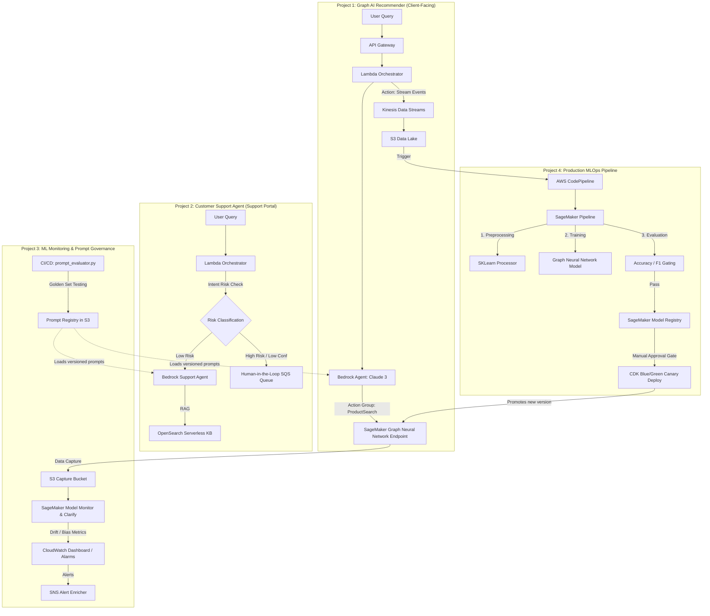
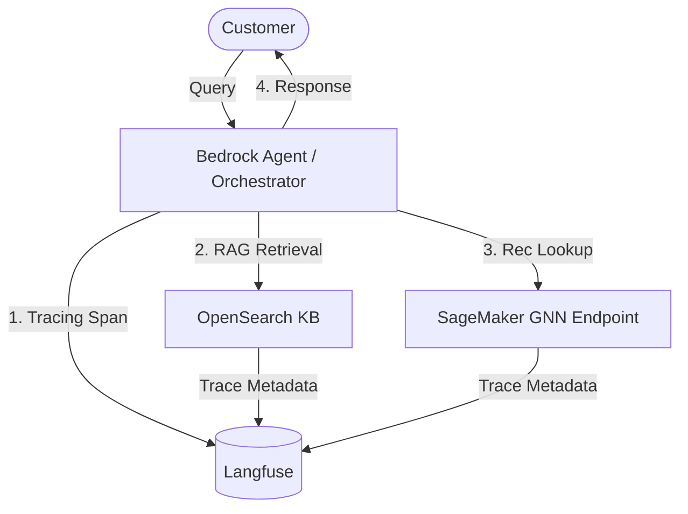

# AWS Graph AI Platform for LEGO Recommendation and Customer Support

Hybrid (LLM + Graph Neural Networks) demo platform with multi-step agentic workflows, ML observability and MLOps pipelines on AWS. Uses fictional LEGO product data.

---

## Architectural Overview

This platform integrates Generative AI with Graph Machine Learning to deliver a personalized, and a continuously monitored product discovery and support system.

- **Hybrid Graph AI** — A Bedrock orchestrator agent interprets user intent and retrieves product nodes from a LEGO Knowledge Graph, combined with a SageMaker GNN (LightGCN) model to rank recommendation candidates.
- **Resilient Agentic Workflows** — Conversational support assistants on Bedrock Agents with runtime schema validation, intent-based risk boundaries, and confidence-based escalation.
- **Continuous Observability & Governance** — Scheduled drift (PSI) and bias (SageMaker Clarify) monitoring for graph embeddings, with LLM tracing and latency tracking via Langfuse.
- **Automated MLOps Pipelines** — SageMaker Pipelines + AWS CodePipeline with manual approval gates, canary blue-green deployments, and compliance traceability.

---

## System Architecture & Components

1. **Graph AI Product Recommender (Project 1)**: Resolves user queries using a hybrid Amazon Bedrock + SageMaker Graph Neural Network (LightGCN) bipartite graph recommendation architecture.
2. **Customer Support Agent (Project 2)**: Handles conversational customer service requests with guardrails, intent-based safety boundaries, and human escalation.
3. **ML Monitoring & Governance (Project 3)**: Audits both systems — tracking graph embedding drift on Project 1's endpoints and running regression testing on Project 2's prompt templates.
4. **MLOps Production Pipeline (Project 4)**: Automates the retraining and deployment of the GNN (LightGCN) model for Project 1 with manual approval gates and canary rollbacks.

### Unified Integration Architecture



---

## Projects at a Glance

| # | Project | Folder | Core AWS Services | Technical Core |
|---|---------|--------|-------------------|----------------|
| 1 | [🧱 Graph AI Product Recommender](#project-1) | [`01-lego-recommendation-engine/`](01-lego-recommendation-engine/README.md) | Bedrock, SageMaker, Kinesis, S3, DynamoDB, Lambda | Hybrid LLM + GNN (LightGCN) recommendation engine, behavioral data streaming, and catalog grounding guardrails. |
| 2 | [🤖 Customer Support Agent](#project-2) | [`02-customer-support-agent/`](02-customer-support-agent/README.md) | Bedrock Agents, Knowledge Bases, Lambda, S3, SQS | Conversational RAG agent, risk classification boundaries, and confidence-based human escalation. |
| 3 | [📊 ML Model Monitoring & Governance](#project-3) | [`03-ml-model-monitoring/`](03-ml-model-monitoring/README.md) | SageMaker Model Monitor, Clarify, CloudWatch, SNS, S3 | Continuous drift detection for graph embeddings, fairness evaluations, and prompt regression testing. |
| 4 | [🚀 MLOps Production Pipeline](#project-4) | [`04-mlops-production-pipeline/`](04-mlops-production-pipeline/README.md) | CodePipeline, SageMaker Pipelines, ECR, CDK | CI/CD graph model retraining, SageMaker model registry gating, and blue/green canary deployments. |

---

## Project 1: Graph AI Product Recommender & Event Engine

Hybrid architecture combining semantic query interpretation with Graph ML. Bedrock parses user intent to retrieve candidates from a Knowledge Graph; a SageMaker **LightGCN** endpoint scores and ranks them based on user-item interaction graphs.

📁 [`01-lego-recommendation-engine/`](01-lego-recommendation-engine/README.md)

**Key Components:**
- **Agentic Semantic Search** — Amazon Bedrock (Claude 3) maps natural-language queries to catalog attributes and fetches context from a graph-derived index.
- **LightGCN Inference Endpoint** — SageMaker endpoint running real-time link-prediction scoring based on graph node embeddings (user-item bipartite graph).
- **Behavioral Event Pipeline** — Clickstream events are streamed via Kinesis Data Streams -> Firehose -> S3 -> SageMaker Feature Store to generate new user-item interaction edges for retraining.
- **Grounding Guardrails** — Output validation layer cross-references Bedrock predictions against a catalog registry, preventing hallucinated product codes from reaching the user.
- **Audit Lineage** — Inbound query contexts, retrieved graph nodes, and inference results are stored in a DynamoDB audit log.

**Interaction Flow:**
```
User Query
      │
      ▼
API Gateway ──► Lambda (Orchestrator)
      │
      ├─► Bedrock Agent (Claude 3 Sonnet)
      │        │
      │        ├─► Action Group: ProductSearch ──► SageMaker GNN (LightGCN) Endpoint
      │        ├─► Action Group: GraphLookup   ──► DynamoDB (User Node Attributes)
      │        └─► Knowledge Base (Product KG) ──► OpenSearch Serverless
      │
      └─► Kinesis Data Stream (Behavior Event Logging)
               │
               ▼
         Firehose ──► S3 Data Lake (Retraining Edges for Project 4)
```

---

## Project 2: Conversational Support Agent & Guardrail Layer

Bedrock Agents-based customer support assistant handling natural-language queries over policy and catalog knowledge bases, with strict safety boundaries and confidence-gated escalation.

📁 [`02-customer-support-agent/`](02-customer-support-agent/README.md)

**Key Components:**
- **Reasoning Agent** — Bedrock Agent with multi-step orchestration and action group routing (knowledge bases, workflow triggers).
- **Conversational RAG** — Context retrieval from corporate policies in OpenSearch Serverless Knowledge Bases.
- **Pre-Execution Guardrails** — Dual-engine intent classifier (regex + Claude Haiku) for risk triage before agent invocation.
- **Post-Execution Verification** — Confidence scorer evaluating output relevance; escalates to SQS human-in-the-loop queue if score < 0.75.
- **Fault-Tolerant Pipelines** — Exponential-backoff retries and Dead Letter Queues for transaction tracking.
- **Prompt Registry** — S3-backed versioned prompt configurations (integrated with Project 3 regression suites).

---

## Project 3: ML Observability & Governance Framework

Telemetry and QA pipeline continuously auditing model endpoints, embedding drift, prompt regressions, and algorithmic fairness.

📁 [`03-ml-model-monitoring/`](03-ml-model-monitoring/README.md)

**Key Components:**
- **Graph Embedding Telemetry** — Scheduled SageMaker Model Monitor jobs tracking data quality, metric drift, and feature attribution (SHAP values) shift in the user-item embedding space on Project 1's LightGCN endpoint.
- **Algorithmic Fairness Audits** — SageMaker Clarify workflows evaluating recommendations for bias (disparate impact metrics) across category slices.
- **Continuous Prompt Regression Testing** — CI/CD automated validation engine (`prompt_evaluator.py`) running candidate prompts against evaluation metrics (BLEU, ROUGE, and LLM-as-a-judge rubrics) before S3 registry release.
- **Compliance Artifact Generation** — Automated model card generator compiling training data metadata, evaluation thresholds, and operational constraints for governance compliance.
- **Operational Dashboards** — CDK-deployed CloudWatch dashboards tracking latency (P50/P95/P99), pipeline throughput, and agent failure logs.
- **Alert Dispatcher** — Lambda-enriched SNS pipelines parsing CloudWatch alarms to route context-rich alert notifications to Slack or PagerDuty.

---

## Project 4: MLOps Continuous Delivery & Training Pipeline

CI/CD pipeline automating Graph GNN training, model evaluation, and deployment, enforcing strict SDLC tracking and controlled canary rollouts.

📁 [`04-mlops-production-pipeline/`](04-mlops-production-pipeline/README.md)

**Key Components:**
- **SageMaker ML Pipelines** — Orchestrated pipelines using SKLearn processing nodes to build bipartite graphs, PyTorch estimators to retrain LightGCN embeddings, and evaluation steps validating output accuracy.
- **AWS CodePipeline Integration** — Ephemeral pipeline triggers executing on S3 feature store updates (sourced from Project 1's streaming events) or training code commits.
- **Model Registry Gate** — Automatic candidate model registration with metrics tracking. Manual promotion gate blocks deployments until governance sign-off.
- **Blue/Green Canary Deployments** — CDK-managed rollouts shifting 10% traffic to the new SageMaker endpoint, with automated rollback based on error rate or latency alarms.
- **Compliance Traceability** — Traceability matrix recorder mapping deployments to Jira ticket ID, Git commit SHA, training dataset URI, and model card artifact paths.

---

## LLM Observability & Tracing (Langfuse)

**Langfuse** supplements CloudWatch with deep LLM tracing across Projects 1 and 2:
- **Trace Spans**: Captures execution lifecycle — agent reasoning steps, vector search retrievals, tool calls, and prompt configurations.
- **Latency & Cost Tracking**: Step-level latency and token usage for real-time cost calculation.
- **Evaluation Loops**: Clickstream feedback (Project 1) feeds back into Langfuse to evaluate model/prompt performance over time.



---

## Technical Stack Summary

| Layer | Services / Tools |
|-------|-----------------|
| **AI/LLM** | Amazon Bedrock (Claude 3 Sonnet/Haiku), Bedrock Agents, Bedrock Knowledge Bases |
| **ML Platform** | SageMaker (Training, Endpoints, Pipelines, Feature Store, Model Monitor, Clarify) |
| **Data** | Kinesis Data Streams, Kinesis Firehose, AWS Glue, S3, DynamoDB |
| **Compute/API** | Lambda, API Gateway, ECS Fargate |
| **Search** | OpenSearch Serverless |
| **DevOps/CI-CD** | CodePipeline, CodeBuild, ECR, CDK (Python) |
| **Observability** | CloudWatch, SNS, X-Ray, **Langfuse** (LLM tracing & costs) |
| **Governance** | SageMaker Model Registry, S3 versioning, IAM least-privilege, AWS Config |
| **IaC** | AWS CDK (Python) |
| **Language** | Python 3.11 |

---

## System Governance & Guardrail Principles

1. **No model ships without an evaluation gate** — automated metrics + human sign-off
2. **Every prompt is versioned and tested** — no ad-hoc prompt changes in production
3. **All model inputs and outputs are logged** — with PII redaction before storage
4. **Drift alerts before business impact** — monitoring is proactive, not reactive
5. **High-risk decisions require human approval** — the agent knows its boundaries
6. **Infrastructure is code** — every environment is reproducible from a CDK stack

---

## 🏗️ Design Decisions & Trade-Offs

| Decision | Rationale | Trade-Off Accepted |
|----------|-----------|-------------------|
| **Bedrock over self-hosted LLMs** | Managed scaling, no GPU infra to maintain, SOC2/HIPAA compliance inherited from AWS | Less control over model weights; cost scales with token volume rather than fixed compute |
| **SageMaker Pipelines over Airflow/Kubeflow** | Native AWS integration, built-in model registry, no separate orchestration infra | Vendor lock-in to AWS; less portable than Kubeflow if multi-cloud is needed |
| **OpenSearch Serverless for RAG** | Zero-ops vector store, automatic scaling, tight Bedrock Knowledge Base integration | Higher per-query cost at scale vs. self-managed OpenSearch; less tuning control |
| **CDK (Python) over Terraform** | Same language as ML code (Python), type-safe constructs, AWS-native L2/L3 abstractions | Smaller community than Terraform; harder to go multi-cloud later |
| **Kinesis over Kafka (MSK)** | Fully serverless, simpler operational model for event streaming at moderate scale | Lower throughput ceiling; less ecosystem tooling than Kafka |
| **Canary deployment over shadow mode** | Real user validation of new model; catches production-only edge cases | Risk of degraded UX for canary traffic if model underperforms |
| **Prompt registry in S3 (versioned) over database** | Immutable versions via S3 versioning, easy IAM-based access control, audit trail built-in | Less queryable than a database; requires wrapper tooling for search/compare |
| **Human-in-the-loop for high-risk vs. full automation** | Regulatory compliance, reduced blast radius, builds trust with stakeholders | Slower response time for flagged interactions; requires on-call human reviewers |

### High-Throughput Evolutions

- **>1M daily inferences:** Shift Lambda orchestration to ECS Fargate for sustained compute and lower cold-start latency.
- **Multi-region:** Deploy DynamoDB Global Tables and multi-region SageMaker endpoints with Route 53 latency-based routing.
- **Multi-model serving:** Use SageMaker Multi-Model Endpoints or inference components for GPU optimization.
- **Multi-cloud migration:** Rebuild infra in Terraform, use Confluent Kafka for streaming, coordinate with MLflow/Kubeflow.

---

## Infrastructure Cost Optimization

The platform follows serverless-first and scale-to-zero patterns for non-production environments.

### AWS & LLM Cost Breakdown

| Service | Non-Production Environment (Scale-to-Zero) | Production Environment (10k daily invocations) | Cost Control & Optimization Strategy |
| :--- | :--- | :--- | :--- |
| **Amazon Bedrock** (Claude 3.5 Sonnet / Haiku) | **$0.00 - $1.00 / mo** *(Pay-per-token)* | **~$150.00 / mo** | On-demand scaling; Haiku for low-complexity QA, Sonnet for reasoning. |
| **SageMaker Endpoint** (Graph Neural Network) | **$0.00 / mo** *(Serverless Endpoint)* | **~$50.00 / mo** | **SageMaker Serverless Endpoint** with concurrency 0; scales to zero, billed per-millisecond of active invocation. |
| **OpenSearch Serverless** (Knowledge Base) | **$0.00 / mo** *(FAISS fallback)* | **~$140.00 / mo** | Non-prod falls back to in-memory FAISS index to avoid OpenSearch baseline costs. |
| **Kinesis & Data Streams** | **$0.00 / mo** *(LocalStack)* | **~$15.00 / mo** | Dev mocks via Moto/LocalStack; prod uses on-demand scaling. |
| **DynamoDB & S3** | **$0.00 / mo** *(Low-capacity)* | **~$5.00 / mo** | Non-prod uses basic capacity; DynamoDB TTL prunes audit logs after 90 days. |
| **CI/CD & MLOps Pipelines** | **$0.00 / mo** *(Idle)* | **~$20.00 / mo** | On-demand pipeline runs; retraining uses EC2 Spot Instances (up to 90% cost reduction). |
| **Langfuse Observability** | **$0.00 / mo** *(Hosted profile)* | **~$15.00 / mo** | Dev uses hosted profile; prod can deploy containerized ECS Fargate with Aurora Serverless. |
| **Total Ecosystem Cost** | **$0.00 - $1.00 / month** | **~$395.00 / month** | **Fully serverless, scales to active invocation demand.** |

---

## Running the Projects Locally

Each project includes a `README.md` with prerequisites, setup steps, and a local development mode using LocalStack or moto for AWS service mocking.

```bash
# Prerequisites
python 3.11+
aws cli v2 configured
node 18+ (for CDK)
docker (for local testing)

# Quick start — Project 1
cd 01-lego-recommendation-engine
pip install -r requirements.txt
python -m pytest tests/ -v
```

---

*All projects use fictional LEGO mock data. No real customer PII is included.*
