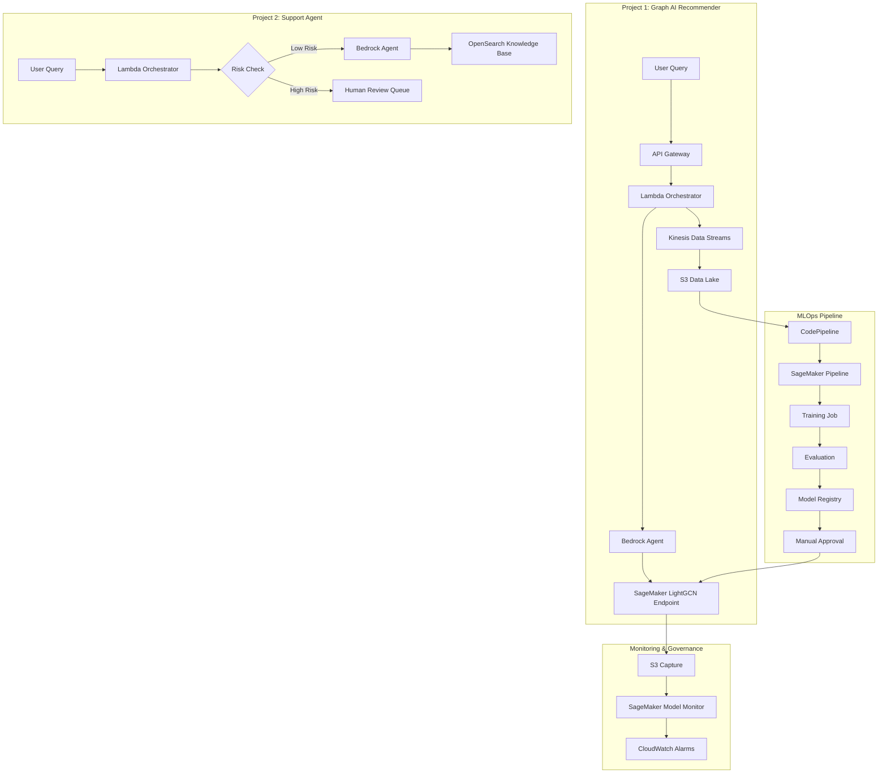

# AWS Graph AI Platform for LEGO Recommendation and Customer Support

A demo platform that combines generative AI and graph-based machine learning for product recommendations and customer support on AWS. It uses fictional LEGO product data.

---

## Overview

The system combines LLM-based agents with graph machine learning to support two main use cases: product recommendations and customer support.

* **Graph-based recommendations** — A Bedrock agent interprets user queries and retrieves relevant products from a LEGO knowledge graph. A SageMaker LightGCN model ranks candidates using user–item interaction data.
* **Support workflows** — Bedrock Agents handle customer support requests with structured flows, validation checks, and escalation to humans when needed.
* **Monitoring and governance** — Model drift, bias checks, and LLM tracing are used to monitor both recommendation and support systems.
* **MLOps pipelines** — SageMaker Pipelines and CodePipeline manage training, evaluation, and deployment with approval gates and controlled rollouts.

---

## System Architecture

The platform is organised into four connected components:

1. **Graph AI Product Recommender (Project 1)**
   Handles product discovery using Bedrock for reasoning and a LightGCN model for ranking.

2. **Customer Support Agent (Project 2)**
   Provides conversational support with guardrails and escalation paths for higher-risk cases.

3. **ML Monitoring & Governance (Project 3)**
   Monitors model performance, embedding drift, and prompt behaviour across the system.

4. **MLOps Pipeline (Project 4)**
   Automates training and deployment of the recommendation model with evaluation and approval steps.

---

### Unified Architecture



---

## Projects

| # | Project                      | Folder                           | AWS Services                                 | Summary                                |
| - | ---------------------------- | -------------------------------- | -------------------------------------------- | -------------------------------------- |
| 1 | Graph AI Product Recommender     | [`01-lego-recommendation-engine/`](01-lego-recommendation-engine/README.md)  | Bedrock, SageMaker, Kinesis, S3, DynamoDB    | LLM + graph ML recommendation system   |
| 2 | Customer Support Agent           | [`02-customer-support-agent/`](02-customer-support-agent/README.md)| Bedrock Agents, OpenSearch, Lambda, SQS      | Conversational support with escalation |
| 3 | ML Model Monitoring & Governance | [`03-ml-model-monitoring/`](03-ml-model-monitoring/README.md) | SageMaker Model Monitor, Clarify, CloudWatch | Drift, bias, and prompt monitoring     |
| 4 | MLOps Production Pipeline        | [`04-mlops-production-pipeline/`](04-mlops-production-pipeline/README.md)| CodePipeline, SageMaker Pipelines, CDK       | Training and deployment automation     |

---

## Project 1: Graph AI Product Recommender

A recommendation system combining LLM reasoning with graph machine learning.

📁 `01-lego-recommendation-engine/`

Key components:

* Bedrock agent for interpreting user queries and mapping them to catalog items
* SageMaker LightGCN endpoint for ranking products using graph embeddings
* Event pipeline using Kinesis and S3 for logging and retraining data
* Guardrails to prevent invalid or hallucinated product outputs
* Audit logging in DynamoDB for traceability

---

## Project 2: Customer Support Agent

A conversational support system built on Bedrock Agents with guardrails and escalation logic.

📁 `02-customer-support-agent/`

Key components:

* Bedrock Agent handling multi-step workflows
* RAG-based retrieval from OpenSearch knowledge base
* Risk classification before agent execution
* Confidence scoring with escalation to human review via SQS
* Versioned prompts stored in S3

---

## Project 3: ML Monitoring & Governance

Monitoring and evaluation system for both recommendation and support systems.

📁 `03-ml-model-monitoring/`

Key components:

* Drift monitoring for graph embeddings using SageMaker Model Monitor
* Bias evaluation using SageMaker Clarify
* Prompt regression testing in CI/CD
* CloudWatch dashboards for system metrics
* Alerting via SNS and Lambda

---

## Project 4: MLOps Pipeline

Automated pipeline for training and deploying the LightGCN model.

📁 `04-mlops-production-pipeline/`

Key components:

* SageMaker Pipelines for preprocessing, training, and evaluation
* CodePipeline triggers for retraining workflows
* Model registry with approval gates
* Blue/green and canary deployments
* Dataset, model, and deployment traceability

---

## Observability (Langfuse)

Langfuse is used to trace LLM interactions across the system:

* Tracks agent steps, retrievals, and tool calls
* Captures latency and token usage per request
* Helps evaluate prompt and model behaviour over time

---

## Tech Stack

| Layer         | Tools                                                  |
| ------------- | ------------------------------------------------------ |
| LLM / AI      | Amazon Bedrock (Claude models), Bedrock Agents         |
| ML            | SageMaker (training, endpoints, pipelines, monitoring) |
| Data          | S3, Kinesis, DynamoDB                                  |
| Search        | OpenSearch Serverless                                  |
| Compute       | Lambda, API Gateway                                    |
| CI/CD         | CodePipeline, CDK                                      |
| Observability | CloudWatch, Langfuse                                   |

---

## Governance Principles

* Models must pass evaluation before deployment
* Prompts are versioned and tested before release
* All inference data is logged with privacy controls
* Drift monitoring runs continuously in production
* High-risk actions require human review
* Infrastructure is fully reproducible using CDK

---

## Design Trade-offs

| Decision              | Why                              | Trade-off                         |
| --------------------- | -------------------------------- | --------------------------------- |
| Bedrock               | Managed LLM infrastructure       | Less control over model internals |
| SageMaker Pipelines   | Native AWS ML orchestration      | Vendor lock-in                    |
| OpenSearch Serverless | Low-ops vector search            | Higher cost at scale              |
| CDK                   | Infrastructure as code in Python | Smaller ecosystem than Terraform  |
| Kinesis               | Managed streaming                | Less flexible than Kafka          |
| Human escalation      | Safer handling of risk cases     | Slower responses in edge cases    |

---

## Cost Notes

The system is designed to scale down in development environments:

* Most services scale to zero in non-production
* Production is usage-based (Bedrock + SageMaker)
* Development cost is minimal
* Production cost depends on traffic, typically a few hundred USD/month

---

## Running Locally

Each project can be run independently with mocked AWS services.

```bash id="z2q8ld"
python 3.11+
aws cli configured
node 18+
docker

cd 01-lego-recommendation-engine
pip install -r requirements.txt
pytest tests/
```

---

All data used in this project is fictional LEGO data and does not include real user information.
